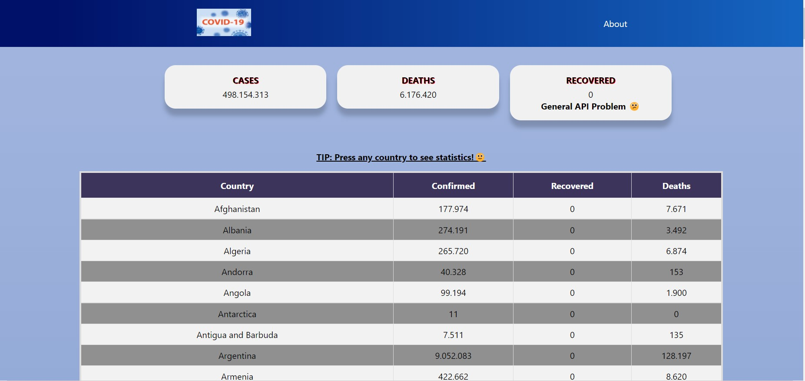
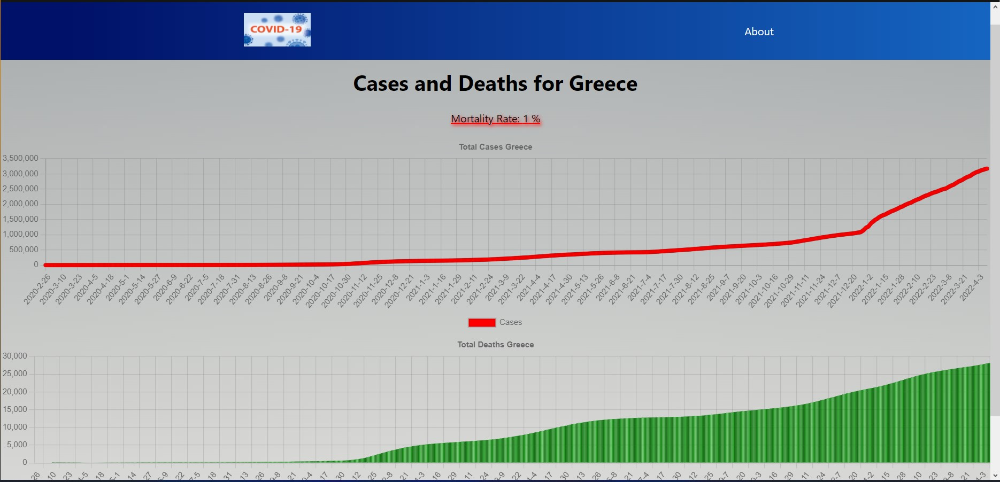

# Covid-19 Tracker

### Chart with  Cases and Deaths for Every Country

  
  

All API Routes 

#### 1) https://github.com/mathdroid/covid-19-api

- /api: global summary
- /api/countries: all countries and their ISO codes
- /api/countries/[country]: a [country] summary (e.g. /api/countries/Indonesia)

#### 2) https://pomber.github.io/covid19/timeseries.json

